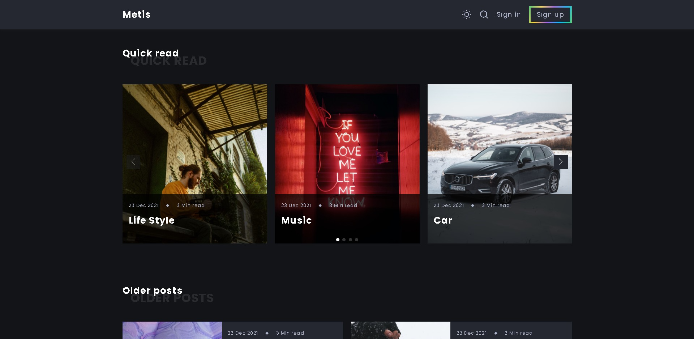

# <a>METIS</a>

<h3>custom blog website 🤳</h3>

# Sass-Practical

<menu>
  <li>Advanced Solid Environment Structure with SASS & Pug.js</li>
  <li>Took Grid Layout to maximum level</li>
  <li>Created Reusable Mixins.</li>
  <li>Used Placeholders %.</li>
  <li>Fully responsive on each device even tinny mobiles.</li>
  <li>Used Swiper.js lib </li>
  <li>Dark theme toggle</li>
</menu>

   
   
TODO:
- [ ] improve pug code.
- [ ] Expandable Email button

   
   
   
  🤩 Leave a :star:&nbsp;if you like it, Please!

 

📫 Please hit me up at mohammed.yuossry@gmail.com if you have any feedback or improvements.
